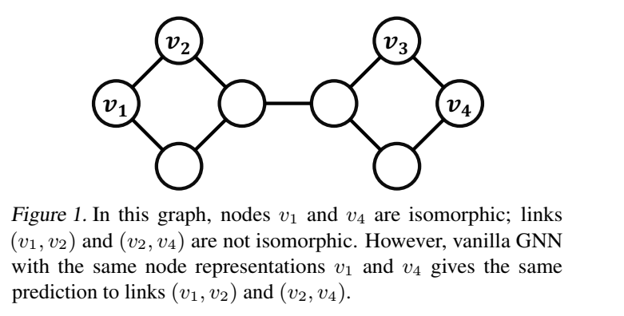
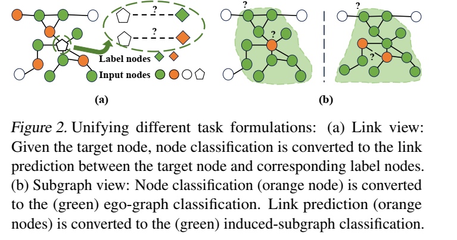
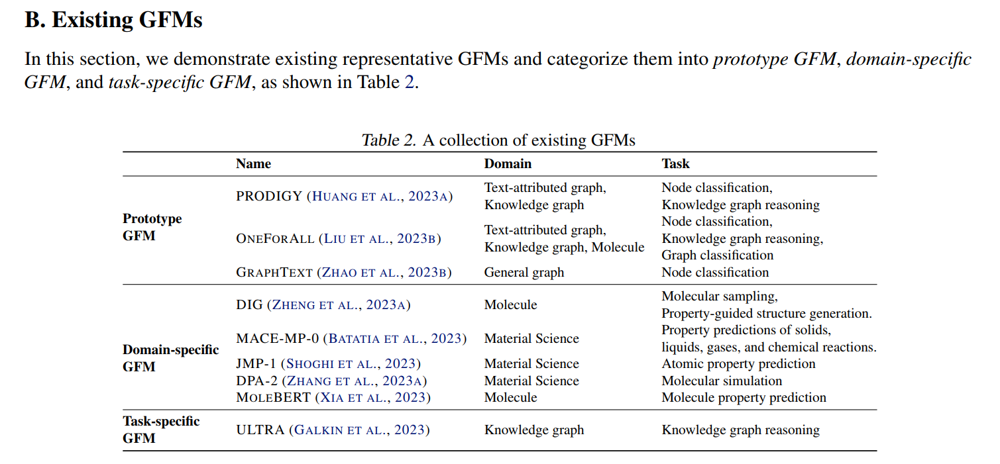

# Graph Foundation Models
https://arxiv.org/abs/2402.02216

目的：开发一个能够在不同图和任务之间泛化的图模型
方法：主张建立一个“图词汇”，其中底层图形下的基本可转移单元编码了图的不变性。从网络分析、理论基础和稳定性等重要方面构建图词汇。

## 1 Introduction
通常，基础模型可以有效地利用来自预训练阶段的先验知识和来自下游任务的数据，以实现更好的性能，甚至可以通过少量任务示范提供有希望的功效
现状：尽管在其他领域的基础模型取得了重大进展，但GFM的发展仍处于初级阶段。迄今为止，尚未实现能够泛化跨广泛图形应用领域的多功能GFM。
- 最近的研究表明了GFM在专业领域的潜力，例如知识图（Galkin等，2023年）和分子结构（Beaini等，2023年）。然而，这些模型通常集中在有限的情景中：它们可能适用于多个数据集，但限于单一任务，涵盖单个领域内的各种任务，或限于一小组数据集和任务。

实现GFM的关键困难在于如何在从社交网络到分子图等各种结构模式的不同图数据之间实现积极转移。来自CV和NLP领域的答案是共享词汇。
- NLP：the text is first broken down into smaller units based on the vocabulary, which can be words, phrases, or symbols. 
- CV：the image is mapped to a series of discrete image tokens based on the vision token vocabulary.

词汇定义了特定领域中的基本单元，可以跨不同任务和数据集进行转移。因此，实现GFM的关键挑战在于我们如何找到图的词汇，即潜在图中的基本可转移单元，以编码图中的不变性。

本文采用的是a graph-centric GFM.

## 2 Existing primitive GFMs and the key reasons for the existing success
目前还没有真正意义上的GFM（一个具有跨所有图任务和数据集转移能力的GFM）。作者此处说的 primitive GFMs指的是现有一些在某些方面取得了初步成功，获得了GFM期望的能力的模型，如Galkin等，2023年；Zheng等，2023a。根据它们的可转移性进一步分为任务特定、领域特定和原型GFM。

### 2.1. 现有的原始GFM
基于模型跨领域和任务的可转移性，粗略地将现有的原始GFM分为三类：任务特定、领域特定和原型GFM。
- **task-specific/domain-specific GFM**
  这种GFM应该能够在特定任务/领域之间转移，并因此适应于各种下游数据集和领域特定任务
  - task-specific 
    - ULTRA： 在各种领域的数据集上实现了优越的零样本知识图完成（zero-shot knowledge graph completion ，KGC）性能
  - domain-specific
    - DiG：通过利用领域特定知识，在各种化学任务中学习通用表示。
- **Prototype GFM**
  - Prototype GFM在有限数量的数据集和任务上有一定的泛化能力。
    - PRODIGY（Huang等人，2023a），它可以在文本属性图上执行节点分类和链接预测的少样本情境学习。
  - 然而，由于Huang等人（2023a）采用了浅层GNN作为其核心模型，鉴于其适度的模型规模，对于额外数据集和任务的可扩展性和灵活性仍然不确定。
  
在图任务上直接使用LLM会产生次优结果，这在对文本属性（Chen等，2023b）和非文本属性图（Wang等，2023a）的研究中有所证实。

一个值得注意的方法是**GraphText**（Zhao等，2023b），它采用了基于树的提示设计（a tree-based prompt design），保留了结构语义，提供了令人满意的少样本情境学习性能。然而，LLM在处理图数据方面遇到了基本问题（Saparov＆He，2022；Dziri等，2023）。这将在第5节进一步讨论LLM在图领域的使用。

### 2.2. The key reasons for the existing GFM success.
ULTRA：一个专注于知识图完成（KGC）任务的特定任务GFM。
  - KGC任务旨在推断缺失的三元组（边），表示为（h，r，t），其中r是查询关系，h和t分别是头实体和尾实体。KGC模型旨在通过预测尾实体t来回答查询（h，r，？）。
  - 成功原因：
    - 利用了NBFNet（Zhu等，2021b）骨干模型，该模型使得对具有表达丰富的关系词汇的新图的归纳泛化成为可能。
    - NBFNet提出了一种**条件消息传递**，可以在以头实体节点和查询关系为条件时学习成对节点表示。这是其成功的第一个原因。
      - 条件消息传递相比标准的、无条件的GNN（R-GCN、CompGCN）相比具有更大的表达能力。这种表达能力有助于区分具有不同结构特征的知识图之间的差异，从而产生合适的关系词汇。
        - 标准的、无条件的GNN将非同构节点对映射到相同的表示，导致了压缩的关系词汇。这种压缩的词汇可能会导致负转移，即跨不同的非同构节点对不恰当地泛化知识。
      - 然而，这种富有表现力的关系词汇仅考虑了预定义的关系类型，在推理过程中不能泛化到具有新关系类型的情景。
  - 为了扩展现有的关系词汇，包括新的关系类型，Galkin等人（2023）**构建了一个关系图，捕获了独立于任何图特定关系类型的基本交互**，这是其成功的第二个原因。
    - 关系图旨在学习双置换等变表示（the double permutation-equivariant representations.）。这种表示对节点实体和便关系类型的置换具有等变性。这种等变性类似于共享的关系词汇。他将未见过的关系类型和现有的关系类型联系起来，并将等变节点映射到相同的表示（尽管关系类型不同），从而实现了正转移。
- ULTRA实现良好的可转移性的关键是找到满足两个原则的KGC合适词汇：
  - 词汇不应压缩，这会导致不同节点对共享表示，可能导致负转移。
  - 词汇应足够包容，可以将新的、未知的关系映射到现有的词汇，可能实现正转移。
- 寻找适合构建GFM的合适词汇的有效性也可以在其他现有原始GFM中找到以下证据。
  - GraphGPT（Zhao等人，2023c）构建了一个数据集特定的词汇表，其中每个节点对应一个唯一的节点ID。值得注意的是，GraphGPT需要在每个数据集上进行特定的预训练和微调。
  - MoleBERT（Xia等，2023）作为分子图的基础模型，手动设计了一个词汇表，将原子属性转换为具有化学意义的代码。
  - OFA（Liu等人，2023b）将所有节点特征手动转换为有意义的文本描述。

## 3. The underlying transferability principle 潜在的转移性原则
上文提到了构建GFM的关键原则是构建一个适合的图词汇表，保持跨数据集和任务的基本不变性。此外，还有更多的图可转移性原则可以发现不同的不变性，并为未来GFM构建新的合适图词汇表提供指导。
以下的讨论主要集中在图结构的可转移性上。
### 3.1. Graph transferability principles
- **Network analysis**
  **网络分析通过识别基本的图模式**，例如网络模式（Menczer等人，2020），**建立关键原则**，例如三角封闭原则（Huang等人，2015）和同质性原则，**提供了对网络系统的传统理解**。这些原则通常适用于不同领域，通常被用来指导先进GNN的设计。
  - 例如，用于链接预测的最先进GNN（Wang等人，2023b）是一个受三角封闭原则启发的神经共同邻居。尽管它有效，但网络分析在很大程度上依赖于专家知识，没有可证明的保证。
- **Expressiveness**
  表达能力提供了一个理论背景，说明图神经架构可以在一般情况下建模哪些函数
  - GNN的图级性能受到Weisfeiler-Leman测试的限制（Xu等人，2019；Morris等人，2019；2023）。
  最具表现力的结构表示（Srinivasan＆Ribeiro，2019）是一个关键概念，**描述了如果仅当节点集对称且具有排列等价性时，两个节点集的表示应该是不变的**。这种表达能力最强的结构表示是设计一个合适的图词汇表的重要原则，它完美地区分了多元预测任务中的所有非同构结构模式。
- **Stability**
  稳定性评估了对图扰动的表示敏感性。它旨在在轻微扰动下保持对成对的预测的有界差异，而不仅仅是表达能力区分同构和非同构情况。稳定性施加了更严格的约束，导致更好的泛化。这可以类比于对图词汇表的约束，在这种情况下，相似的结构模式应该具有相似的表示。

此外，还有一些其他挑战会影响更深层次的GNN设计，以包含更多的高阶信息。更深层次的GNN可能会受到性能下降的影响，并且无法捕获更高阶的结构信息。主要有三个问题：
- **过度压缩问题**说明节点表示对于重要但远距离节点的信息不敏感。
- **过度平滑问题**说明更多的聚合导致节点表示收敛到唯一的平衡点，失去了不同节点之间的区别。
- **不可达问题**说明无法探索、覆盖或影响图中的所有相关节点，导致信息丢失。

### 3.2. Transferability principles in node classification

- **Network analysis**
  - 基于同质性原则构建的现有GNN架构在各个领域的各种同质图上展现出了强大的性能。遵循同质性不仅增强了模型的有效性，还促进了模型在同质图数据集之间的可转移性。
    - 同质性描述了连接的节点通常具有相似特征的现象，是社会科学中长期存在的原则。它作为一项基本原则指导着从传统的PageRank和标签传播到最近的先进GNN方法的方法。
  - 基于同质性原则构建的GNN通常在异质网络中表现不佳，除非是“良好的异质性”情况（Ma等人，2021；Luan等人，2021），在这种情况下，GNN可以识别和利用不同节点之间连接的一致模式。然而，大多数异质网络都是复杂且多样的，由于其不规则和复杂的交互模式，给GNN带来了挑战。

- **Stability**
  You等人（2023）在理论上建立了可转移性和网络稳定性之间的关系，证明了具有增强的谱平滑性和较小的最大频率响应的图滤波器（ enhanced spectral smoothness and a smaller maximum frequency response）在节点特征和结构方面的可转移性得到了改善。
  - **spectral smoothness** 由相应GNN的图滤波器函数的Lipschitz常数表征，表示对边扰动的稳定性。
  - **the maximum frequency response**反映了应用图滤波器后的最高谱频率（实质上是拉普拉斯矩阵的最大特征值），描述了对特征扰动的稳定性。

### 3.3. Transferability principles in link prediction
- **Network analysis**
  - **对应于三角封闭原则的局部结构接近性**，即朋友的朋友会成为朋友。
    - CN、RA、AA（Adamic＆Adar，2003）。
  - 对应于衰减因子原则的全局结构接近性，即两个之间存在更多短路径的节点具有更高的连接概率。
    - Simrank和Katz（Katz，1953；Jeh＆Widom，2002）
  - 对应于同质性原则（Murase等人，2019）的特征接近性，即连接的个体之间存在共享的信念和想法。
    - 指导了链接预测算法的演变，从基本的启发式到复杂的GNN
- **Expressiveness**
  一个只具有单节点排列等价性的简单GNN无法对链接预测任务实现可转移性，因为它缺乏表达能力。
  一个例子可以展示这种失败，如图1所示，其中是一个无特征的图。v1和v4由简单GNN表示相同，因为它们具有相同的邻域结构。因此，v1和v2之间的相似度与v4和v2之间的相似度相同，导致两个链接（v1，v2）和（v2，v4）的表示和预测相同。**然而，根据全局结构接近性，（v1，v2）的距离更短，应更有可能连接**。简单GNN仅从其邻域计算v1的表示，忽视了与v2的结构依赖关系。因此，这可能导致负转移，在这种情况下，GNN可能会错误地预测两个链接都存在或都不存在，而更有可能的是只有（v1，v2）存在链接。

为了考虑节点对之间的所有可能依赖关系，我们的目标是对链接预测进行最具表达能力的结构表示。这种表示应该在仅当链接对称时不变。
  - 张和陈（2018）通过结合依赖于链接的源节点和目标节点的节点标记特征来实现这种结构表示。
  - 张等人（2021）进一步强调了节点标记设计的关键方面，包括：
    - （1）区分目标节点，其中源节点和目标节点与其他节点具有不同的标签；
    - （2）置换等变性。
    - 符合这些标准的节点标记方法:
      - 双半径节点标记（DRNL）和零-一（ZO）标记，可以产生最具表达力的结构表示。**表达力表示可以找到完整的不同关系集，以区分所有非同构节点对，从而减轻标准GNN中负转移的风险。**
  - 黄等人（2023c）将关系Weisfeiler-Leman框架扩展到链接预测，并将标记技巧的概念引入到多关系图中。

- **Stability**
  对于那些同样具有表达能力的结构表示来说，它们在稳定性方面仍可能存在差距。
  - 经验证据（张等人，2021）表明，具有DRNL标记的GNN优于具有ZO标记的GNN。
  
  从稳定性的角度来看，对于轻微扰动的节点对的预测，保持有界的差异是至关重要的。
  - Wang等人（2021）提供了一个理论分析，确定了稳定位置编码的关键属性（GNN应该对位置编码具有旋转和置换等变性），从而增强了泛化能力。
### 3.4. Transferability principle in graph classification
- **Network Analysis**
  - Network motifs通常由小型且经常重复的子图组成，通常被认为是图的构建模块。正确选择的模体集可以涵盖特定数据集上的大部分基本知识。
    - 图核函数（Vishwanathan等人，2010）被提出来量化模体计数或其他预定义的图结构特征，然后利用提取的特征构建分类器，例如SVM。
  - 尽管来自不同领域的基本模体集通常不同，但可能存在跨不同领域共享的统一motif集。在这种情况下，可以在统一集合上找到积极的转移。
    - Battiston等人（2020）展示了在神经连接网络、食物网络和电子电路之间的积极转移。
  
  **推测Network motifs可以作为图分类的词汇表（一组不变元素）的基本单位**，因为它既具有解释性，而且在不同的图之间可能是共享的。
- **Expressiveness**
  - 张等人（2024）提出了一个统一的框架来理解不同GNN对于检测和计数图子结构（motif）的能力。
  - 更具表达力的GNN可以检测到更多样化的motif，并构建更丰富的图词汇表。
  - 推测：**具有更高表达能力的GNN更有可能发现统一的motif set**，并实现更好的可转移性。
- **Stability**
  黄等人（2023d）提出了一种经过证明的稳定位置编码，超越了表达符号和不变编码（Kreuzer等人，2021）以及建模（Lim等人，2022），使得对拉普拉斯的轻微修改最小的位置编码变化。关键创新是对特征向量进行加权求和，而不是独立地处理每个特征子空间。在分子图预测的离群分布上观察到了令人满意的性能。

### 3.5. The transferability across tasks
通常采用统一的任务形式来促进在各种任务之间的可转移性。
任务形式需对齐。
- n等人（2020b）表明，直接将链接预测作为先验任务会导致对节点分类的负转移。
- 通过将节点分类重新构造为一个链接预测问题（Sun等人，2022；Huang等人，2023a），其中将节点的类成员身份视为节点与标签节点之间的链接可能性，可以实现积极的转移。
- Liu等人（2023g）；Sun等人（2023）进一步提出了将节点分类调整为以自我图分类为目标，将链接预测调整为对目标节点对的诱导子图进行二元分类的子图视图。图2提供了这两种统一视图的示例。
  

- 统一的任务形式使得
  - 通过将不同下游任务的数据集转换为一个数据集来扩大数据集大小
  - 利用一个预训练模型来服务于不同的任务成为可能。
- 除了统一形式之外，在不同任务上有共享的原则列举如下：
  - 节点分类和链接预测任务共享特征同质性作为一个重要原则。
  - Liu等人（2023d）指出，在链接预测中的全局结构接近性原则可以提高非同质图上的节点分类性能
  - 在链接预测中的三角闭合是图分类中利用的特定network motif。在图分类和链接预测任务中有更多共享的模体（Hibshman等人，2021；Dong等人，2017；AbuOda等人，2020；Kriege等人，2020）。
## 4. Towards GFM following neural scaling law （神经缩放定律）
基础模型的成功可以归因于神经缩放定律的有效性，该定律显示随着模型规模和数据规模的增加性能得到提升

### 4.1. When neural scaling law happens
在存在不确定性和相反的图构造时，扩展行为可能不会发生，因为数据不遵循图可转移原则。
### 4.2. Data scaling 数据扩展
在数据扩展方面，研究者首先验证了在分子属性预测和文本属性图的节点分类等任务中，监督和自监督训练的图神经网络都遵循数据扩展定律。此外，研究者还发现预训练数据与下游任务数据的相似性是数据扩展的先决条件。然而，目前数据扩展研究的一个限制是数据集规模较小，特别是与大型语言模型（LLM）的预训练相比。图领域高质量数据的稀缺可能是造成这种差异的原因。

- **Tackling feature heterogeneity**
  解决特征异质性也是一个重要挑战。现有的图数据集由于缺失特征和不同的语义空间而无法统一利用于预训练。
  - 特征插值技术通常用于根据相邻特征预测缺失属性，但这些技术要求每个特征维度具有相同的语义含义。
  - 当特征未对齐时，一些研究者通过手动转换原始特征，并使用LLM进行编码。此外，在预训练模型输入和测试数据之间的推理阶段，特征不对齐也可能存在。
- **Generating synthetic graphs**
  生成合成图是增强数据扩展和增大训练数据规模的另一途径。
  - 传统的图生成模型能够生成满足某些统计特性的图，这在节点级和链接级任务中仍然发挥着重要作用。
  - 近年来，深度生成模型在生成高质量合成图方面取得了巨大成功，这有助于提供对图分布空间更全面的描述，从而增强图级任务的性能。
  
  预训练合成数据在其他领域已经取得了成功，因此我们有望利用合成图进行大规模预训练，以实现对GFM的进一步推进。
### 4.3. Model scaling
除了数据外，骨干模型构成了扩展的基础
  - 刘等人（2024）主要在监督设置下验证了在各种图任务和模型架构中的神经缩放定律。
  - Kim等人（2022）证明了具有更多参数的GAT（Veli ˇckovi ́c等人，2017）在图回归任务中表现不及较小尺寸的对应模型。
  - 几何图神经网络在材料科学中预测原子势能方面表现出良好的扩展性（Shoghi等人，2023；Zhang等人，2023a；Batatia等人，2023）。
  
>这种矛盾现象表明了图神经网络的几何先验与特定任务之间的对齐可能会影响模型的扩展。

图变换器是另一种流行的模型架构选择，其中通过图神经网络或位置编码明确地对几何先验进行建模。
- asters等人（2022）；Lu等人（2023）展示了在监督设置下，图变换器显示出对分子数据的积极扩展能力。
- Zhao等人（2023c）证明了vanilla transformer在蛋白质和分子属性预测中的有效性。特别是，它将图视为形成欧拉路径的token序列，从而确保了无损序列化，然后采用了下一个令牌预测来预训练变换器。vanilla transforme也遵循模型缩放定律。尽管如此，这种纯变换器在其他任务上的有效性仍然不清楚。

### 4.4. Pretext task design
介绍了预文本任务设计的重要性，特别是在标记数据稀缺的情况下，它是实现更大规模神经网络缩放的关键。主要讨论了两种代表性的预文本设计方法：图对比学习和生成式自监督学习。
- 图对比学习设计了预文本任务，，通过对比图的原始和增强视图来获得等价性，而不实质性地改变输入的语义内容。
  - Zhu等人（2021a）观察到，令人满意的性能需要预文本任务和下游任务分享相似的理念，比如同质性。
  - Ju等人（2023）通过多任务学习框架自适应地将具有不同理念的预文本任务结合起来，以获得有利于不同下游任务的预训练模型。
- 生成式自监督学习试图捕获不同任务之间共享的数据生成过程。特别地，它们尝试使用剩余结构和特征来预测图的遮蔽部分。
  - Liu等人（2023f）；Xia等人（2023）进一步观察到，任务粒度在生成建模中也起着重要作用。
    - 采用节点级别的预文本任务可能导致模型仅学习低级特征（Liu等人，2023f），而忽略了对图级任务至关重要的全局信息。
    - 方法：预训练阶段采用了基于GNN的标记器，以显式地建模高级信息，从而提高下游任务的性能。
  -   下一个标记预测（NTP）预文本任务（Zhao等人，2023c）在分子图上取得了初步成功。
      -   这是第一个展示模型缩放经验证据的预文本任务。
      -   成功的原因可能是：
          - 构建了一个固定的标记集，在有限集中缩小了问题空间，只需预测离散标记
          - 选择了变换器作为骨干模型。
## 5. Insights & open questions
- **The usage of LLM in the graph domain**.
  - 带有文本属性的图上：
    - Chen等（2023b）；He等（2023）将节点分类视为目标节点上的文本分类，即使在没有任何结构信息的情况下也能展示出有希望的结果。
  - 对于没有文本属性的图：
    - Fatemi等（2023）；Wang等（2023a）通过用自然语言描述图结构来将数据输入LLM。观察结果表明，LLMs在理解基本图结构方面的能力有限。
      - LLMs需要贪心地逐个解决问题（McCoy等，2023），导致了一种捷径解决方案（Saparov和He，2022；Dziri等，2023），而不是对图结构进行正式分析。
    - Yue等（2023）指出了在推荐系统中使用LLMs时的效率问题，即下游的链接预测任务。
    - Tang等（2023）；Ye等（2023）；Chai等（2023）利用GNN对图结构知识进行编码，然后引入线性层将从GNN获得的嵌入转换为文本空间作为a prompt token。这些模型可能表现出色，但仍然存在两个缺点：
      - 处理结构的能力受到GNN能力的限制
      - 指导调整可能成本高昂，而调整后的模型只能处理相应的下游任务，而不能转移到其他任务和数据集上，这使得它们的能力与GFM有一定距离。
  
  - LLMs在图结构方面的作用是否应该是GFM建设的关键角色，还是仅仅作为更好的文本特征编码器，尚不清楚。
    - 一个有效处理图结构的潜在策略可能受到多模式基础模型（Liu等，2023c）成功的启发。 关键思想是利用预训练的分词器将图结构映射到一系列离散标记，这样可能会将图形转换为LLMs可理解的格式。
 
- **Efficiency issue in subgraph-based methods**.
  基于子图的提取是实现归纳推理（Zeng等，2021）和统一不同任务表述的广泛采用的技术。
  - 但是存在以下问题：
    - 高阶邻域中的信息丢失
    - 冗余子图信息导致内存消耗过多
    - 基于普通子图提取的时间复杂度随着跳数的增加而呈指数增长
  - 图抽样技术（如Zeng等，2019）和全局状态向量（Fey等，2021）等方法可以帮助缓解这些问题。
  

- **Potential redundancy on pre-text task and architecture design**.
  -  实现可转移性主要有两种方法：
     -  设计具有特定几何属性的GNN，例如ULTRA（Galkin等，2023）
     -  创建预文本任务以自动学习这些属性。
  - Jin等（2020b）指出了这些技术之间的重叠，表明针对局部结构信息的预文本任务可能是不必要的，因为GNN通常本身就会编码这些信息。
- **The necessity of GFM**.
  提到了对于不同标准定义的图可能存在的可观察性和不可观察性，以及在不同领域的图上训练GFM所面临的挑战和不确定性。
- **GFMs on more applications**.
  探讨了GFM在更广泛应用领域的潜在应用，如计算机视觉、线性规划和物理学等，以及在材料科学领域已经取得的成功案例。最后，它提到了知识图基础模型可能对生成高质量场景图具有积极作用的可能性。
## 6. Conclusion
通过对图的可转移性原则的审视，回顾了现有的GFM，并从词汇视角对其有效性进行了论证，以找到跨图和跨任务的一组基本可转移单元。
主要观点可以总结如下：
- 构建一个通用的GFM是具有挑战性的，但是具有特定领域/任务的GFM是可以通过使用特定词汇实现的。
- 一个挑战是按照神经缩放定律开发GFM，这需要在数据工程、架构和预文本任务方面进行原则驱动的设计。

本文总结了当前的位置和面临的挑战，这可能成为启发相关研究的GFM的蓝图的一步。

