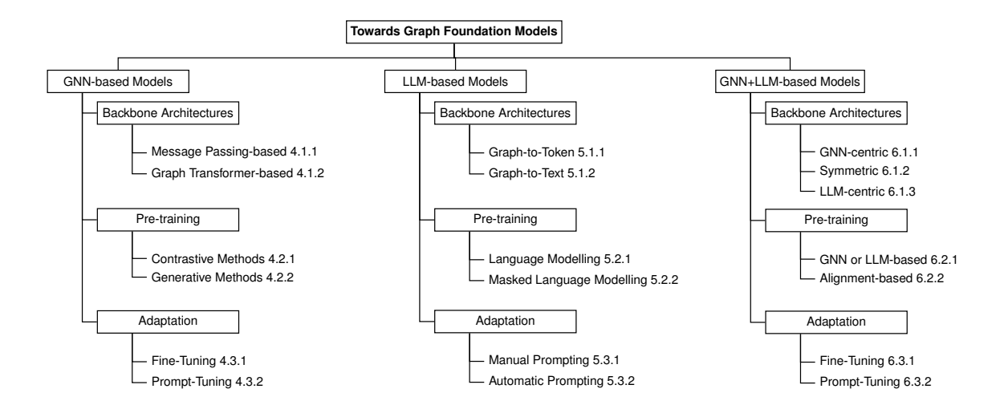
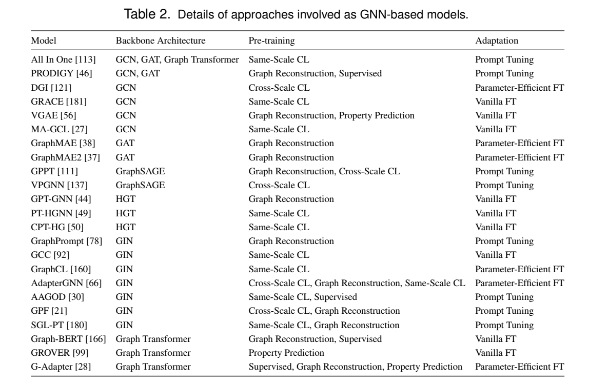
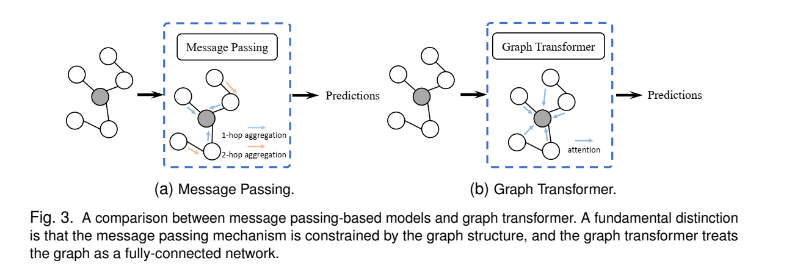
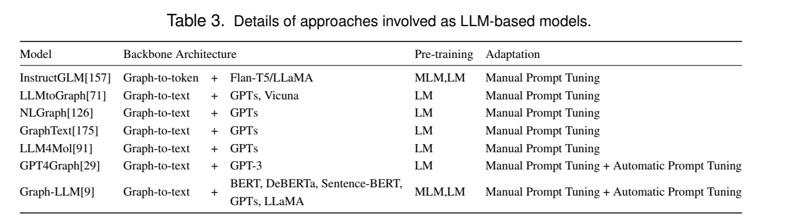
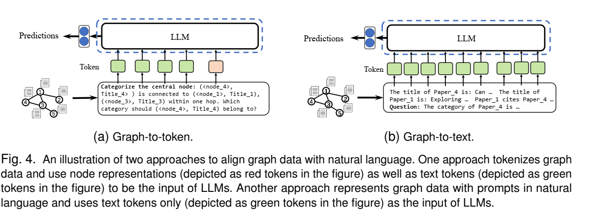
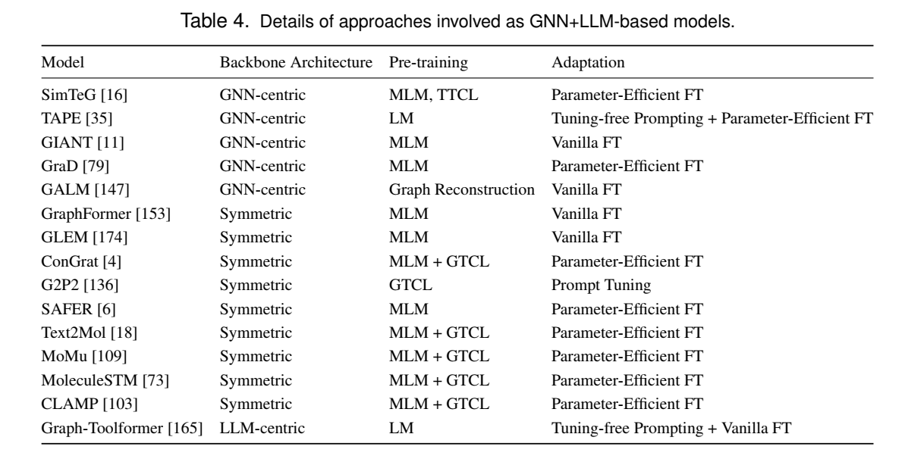
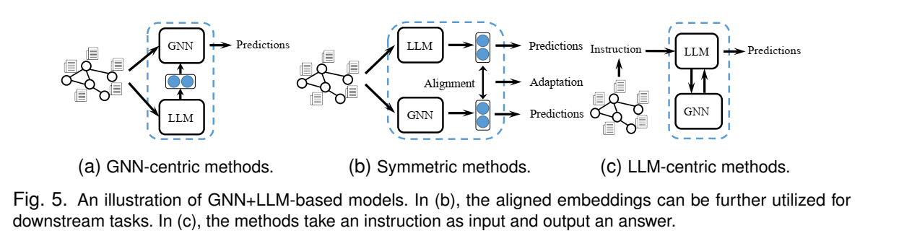

# Towards Graph Foundation Models: A Survey and Beyond
https://arxiv.org/abs/2310.11829
###  2.1 Deep Graph Learning（深度图学习）
#### 2.1.1 图数据

1. **非欧几里德性质**：
   - 与欧几里德数据相比，图数据明确地编码了实体之间的复杂连接，不具有固定邻域区域和确定性顺序。

2. **各种领域**：
   - 图数据在社交网络、生物学、交通运输等各种领域中广泛存在。
   - 不同领域的图数据可能具有不同的特征，包括节点类型、边的语义和结构模式。
   - 例如，在生物网络中，节点可以是蛋白质、基因或代谢物，而边可能表示蛋白质间相互作用或代谢反应。

3. **各种类型**：
   - 图数据具有多种类型，包括同质图、异质图、超图和动态图等。
     - 同质图包含相同类型的节点和边，例如由论文组成的引用网络。
     - 异质图包含多种类型的节点或边，例如包含作者和论文的引用网络。
     - 超图由连接多个节点的超边组成，可以模拟节点之间的高阶关系。
     - 动态图指的是节点和边随时间变化的图结构，例如交通流量变化形成的交通网络。

这些特性使得创建一个能够有效泛化和适应各种图结构的通用模型具有挑战性。
#### 2.1.2 骨干架构

图神经网络（GNNs）是深度图学习的主要框架，采用消息传递机制进行节点间信息交换。常见的GNNs包括GCN和GAT等，它们通过引入图卷积层和注意力机制来增强节点表达能力。

深化GNNs面临的挑战包括过度平滑和过度压缩问题。近年来，一些方法如DropEdge和图变换器被提出来解决这些问题，从而提高了模型性能。

#### 2.1.3 学习范式
深度图学习的学习范式包括三个主要类别：监督学习、半监督学习和无监督学习。

### 2.2. 语言基础模型
 - 特定自然语言模型（如GPT-3）通过大规模自监督学习和广泛多样的数据集训练。
 - 采用预训练和适应框架，具有涌现能力和同质化等优势。

#### 2.2.1 **语言数据**：
   - 涵盖文本或口头内容。
   - 质量和数量影响系统性能，标记语言数据相对较少，但未标记数据量大,可以用于模型预训练。
   - 与图数据相比，语言数据作为欧几里得数据更容易建模，其丰富的语义信息显著增强了语言模型的知识可迁移性。
#### 2.2.2 骨干架构

1. **预训练语言模型（PLMs）**：
   - PLMs早期突破，捕捉上下文感知的单词表示。
   - BERT是其中的代表，基于Transformer架构和自注意力机制，在大规模未标记数据上进行预训练，通过特定设计的预文本任务构思而成。

2. **更大规模的PLMs（LLMs）**：
   - 规模更大的PLMs在下游任务中表现更出色。
   - LLMs利用Transformer架构，加速预训练阶段，并能够利用大规模数据集。
   - 典型的LLMs如GPT-3、PaLM、Galactica和LLaMA等，拥有数千亿甚至更多的参数。

#### 2.2.3 学习范式

1. **预训练和微调**：
   - 预训练语言模型（PLMs）首先在大规模未标记数据上进行预训练，获取通用语言表示。
   - 预训练提供改进的模型初始化、正则化和通用能力，但仍需微调以适应特定任务或领域。
   - 微调通过调整预训练模型参数，转移知识并提高模型性能，利用了预训练模型在下游任务中的通用能力。

2. **预训练、提示和预测**：
   - 这种方法重新塑造下游任务，使其与预训练语言模型的处理任务更接近。
   - 通过提供文本提示来指导语言模型行为，以实现预测所需输出。
   - 提示工程可分为手动和自动方法，通过选择合适的提示，单个语言模型可以处理多种任务。

   - 提示策略分为无调整提示、提示调整和指令调整，分别基于提示生成答案、引入额外的提示相关参数并更新，以及在微调的基础上引入指令来指导模型行为。

## 3. 图基础模型

### 3.1 图基础模型的概念

- **定义和关键特征**：
  - 图基础模型（GFM）是一种期望从广泛的图数据的预训练中受益，并且可以适应各种下游图任务的模型。
  - 与端到端训练的深度图学习相比，GFM使用预训练获取未标记图数据的知识，然后使用适应技术适应下游任务。
  
- **关键特征**：
  - **新能力（emergence）**：随着模型参数数量的增加和更多数据的训练，GFM将展示出一些新的能力，如上下文学习、图推理和零样本图生成。
  - **同质化（homogenization）**：GFM可以应用于不同类型的图任务，如节点分类、链接预测和图分类，尽管实现同质化仍存在挑战。

- **未来研究方向**：
  - 对于GFM的新能力的研究仍较少，需要进一步探索和发展。
  - 实现图任务同质化的方法仍需要进一步研究和探讨，目前尚无共识。
#### 3.1.2 关键技术

- **预训练 (Pre-training)**：
  - 预训练是图基础模型发展的关键概念，类似于语言模型中的作用。
  - 它利用自监督学习在大规模图数据集上预训练神经网络，学习捕捉图中的结构信息、关系和模式。
  - 预训练策略包括对比自监督学习和生成自监督学习，以及利用预训练的语言基础模型。
  
- **适应 (Adaptation)**：
  - 图基础模型的适应涉及将这些模型调整到特定的下游任务或领域以增强其性能。
  - 适应技术包括普通微调、参数高效微调和提示微调，使图基础模型能够在各种应用中发挥作用。
  - 提示微调是一种多功能方法，依赖于外部提示来指导模型的行为，使其更具适应性和有效性。

#### 3.1.3 图数据的影响

- **图类型 (Graph Type)**：
  - 同质图和异质图是常见的图类型，对于图基础模型，处理异质图会带来更大的挑战。
  - 利用基于元路径的方法，可以将异质图映射到多个同质图中，以处理异质性。

- **图规模 (Graph Scale)**：
  - 小型图和大型图对图基础模型的能力提出了不同的要求，大型图具有更多的噪声和更长的依赖关系。

- **图多样性 (Graph Diversity)**：
  - 同领域图和跨领域图对于图基础模型也提出了不同的挑战，跨领域图可能导致弱传递性或负传递性的问题。
  - 解决不同领域的异质性，并使相同的图基础模型适用于不同领域的图是一个重要挑战。

#### 3.1.4 图任务的影响：
图基础模型与语言基础模型类似，能够广泛应用于各种图任务，这些任务的格式可以分为节点级、边级和图级三类。

- **节点级任务**：节点级任务涉及对每个节点执行的分类、回归或预测任务，如节点分类、节点回归和聚类系数预测。在社交网络中，节点分类可用于识别不同社交圈子中的用户。

- **边级任务**：边级任务涉及对每个单独边执行的分类、回归或预测任务，如边分类、链路预测、最短路径预测等。在电子商务中，链路预测可用于预测用户可能感兴趣的产品。

- **图级任务**：图级任务关注整个图，包括图分类、图回归、图生成、图聚类等。在生物信息学中，图属性预测可用于预测分子化合物的生物活性或毒性，从而加速药物发现过程。

图任务的格式多样，涵盖节点级、边级和图级任务，每种类型都有广泛的应用。这增加了图基础模型的同质化挑战。不同类型的任务可能需要不同的建模方法，但增强的表达能力有望提高许多任务的性能。
### 3.2 图基础模型和语言基础模型的比较
**相似性**：都遵循预训练和微调范式。目标都是增强模型的表达能力和提高在各种任务中的泛化能力。他们首先在大型、多样化的数据集上预训练模型，然后将其适应特定于任务的数据。
**内在差异**：
表现在数据集和任务两个方面。
- 数据
  - LLM：欧几里得数据，文本数据。不管来自哪个领域，都有共同的词汇表。
  - GFM：非欧几里得数据，或者与欧几里得数据的混合。图数据更能捕获复杂的数据关系，并且比较稀疏。图的类型和规模都影响GFM的设计。不同的图数据缺乏共性。例如，节点表示分子图中的原子，而节点表示社交网络中的用户，完全不同。
- 任务
  - LLM：任务多但是都比较同一，处理文本数据并使用文本中的语义和语法解决问题
  - GFM：任务范围窄但是多样，比如结点分类，链预测和图分类。
任务上的差异意味着GFMs不能像LLMs那样学习，这显著增加了GFMs在下游任务中的适应性挑战。

**外在差异**：
- 骨干架构：
  - LLMs：主要基于Transformer架构。Transformer 在表达能力、可扩展性、并行性以及它在处理各种 NLP 任务方面的出色性能方面的优势使其成为 LLM 的主流主干架构。
  - GFM：目前还没有统一的主干架构。使用主流 GNN 作为主干架构不一定合适。这主要是因为gnn的表达能力和泛化能力有局限性，它们的参数大小往往太小，无法表现出涌现能力。
- 同质化：
  - LLM：easy
  - GFM：由于图结构知识的可转移性较差，GFMs的同质化更具挑战性。
    - 现有的工作试图通过将各种任务统一为链接预测或图级任务来实现同质化。
    - 构建数据任务异构图可以在不同的任务之间建立连接，但它是一个更复杂的过程。
- 领域泛化Domain Generalization：
  - LLM：在各种语言相关领域有很强的域泛化能力
  - GFM：跨数据集表现出较弱的泛化，尤其是在移动到跨域图数据时。
- 涌现：
  - LLM：可以基于少量的样本和指令生成连贯且上下文相关的文本。代表性的涌现能力包括：上下文学习、思维推理链、零样本生成。
  - GFM：GFMs尚未像语言基础模型那样显现出明显的涌现能力。只有少数最近的研究讨论了GFMs的上下文学习、图推理和零样本图生成能力。

## 4 基于GNN的图模型
  
### 4.1.骨干架构

已经提出了大量的图神经网络，并且它们已被广泛应用于各种与图相关的下游任务中。这些网络被用于特征提取，通常作为图模型的基础组件，通常被称为“骨干”。在本小节中，我们介绍了两种先进的图神经网络骨干：基于消息传递的方法和基于变换器的方法。

#### 4.1.1 Message Passing-Based Methods.
Message Passing-Based Methods 指的是基于消息传递的方法，其中消息传递神经网络（MPNNs）代表了一类广泛的图神经网络架构.在消息传递机制中，每个节点从其相邻节点聚合信息，处理该信息，然后在一系列迭代步骤中向其邻居发送消息。典型的消息传递过程可以被形式化为：
$h_v^{k+1}=U_k(h_v^k, \sum\limits_{u\in N(v) } M_k(h_v^k,h_u^k,X_{u,v}^e))$ 
其中，$h_v^k$ 和 $h_v^{k+1}$ 分别表示节点 v 在第 k 层和第 k+1 层的嵌入。$X_{u,v}^e$ 表示边 $(u,v)$ 的边属性。$N(v)$ 表示节点 v 的邻居。$M_k(·)$ 和 $U_k(·)$ 分别表示第 k 层的消息和更新函数。
>"节点 v 在第 k 层和第 k+1 层的嵌入" 表示节点 v 在图神经网络的第 k 层和第 k+1 层中的特征表示或向量表示。在图神经网络中，每个节点都会被表示为一个特征向量，这个向量包含了节点的特征信息，通常用来描述节点在图中的属性、结构和上下文等。在神经网络的每一层中，节点的特征向量会根据网络的权重和激活函数进行变换和更新，从而得到不同层次的表示。因此，"节点 v 在第 k 层的嵌入"指的是在神经网络的第 k 层中，节点 v 的特征表示；而"节点 v 在第 k+1 层的嵌入"则表示在神经网络的第 k+1 层中，节点 v 的特征表示。

许多现有的基于图神经网络的模型利用消息传递模型作为其骨干。
- GCN: GCN 使用一种局部一阶谱图卷积逼近的方法，目的是同时捕获图结构和编码节点特征。
  >- 局部：表示这种近似是局部的，即他只关注与结点直接相连的邻居结点。
  >- 一阶：表示这种近似是一阶的，即只考虑节点与其直接相连的关系，而不考虑更远的距离
  >- 谱图卷积：一种基于图的频率理论的卷积操作，用于在图结构中进行特征提取和处理。
  >图结构：图中节点之间的连接关系
  >- 编码节点特征：将节点的信息嵌入到卷积擦欧总中，以便后续的图神经网络处理。
- GAT：  一些研究使用GAT 作为其骨干架构，GAT 用注意机制替换了 GCN 中的平均聚合操作，利用加权聚合方法进行了改进。此外，多头注意力技术可以进一步用于增强 GAT 的性能。
- GraphSAGE ： GPPT 和 VPGNN 使用 GraphSAGE 作为其骨干，该方法通过对每个目标节点抽样固定大小的邻居节点子集，然后通过聚合和处理这些抽样邻居的嵌入来学习嵌入。
- HGT ：对于异构图，一些研究使用 HGT 作为其骨干，它引入了专门的注意力机制来进行邻域聚合。与全局注意力不同，HGT 利用类型特定参数来定义图中每条边上的异构注意力。
- GIN ： 为了提高表达能力，一部分研究依赖于 GIN 作为其主要架构。GIN 是一种基于消息传递的模型，其表达能力在理论上等价于 1-WL 测试。由于 GIN 的表达能力，它经常被选择为许多基于GNN的模型的骨干。对于消息传递型图神经网络的深入探讨，参考文献[144]。

#### 4.1.2 Graph Transformer-Based Methods. 基于图变换器的方法

图变换器在分子预测任务中表现出了很好的结果，这要归功于其**全连接的自我注意机制**。这种机制使得它能够应对传统消息传递型图神经网络的缺点，因为它具有**较长的范围建模能力**和**强大的表达能力**。

基于消息传递机制的模型和图变换器之间的主要区别在于它们对底层图结构的处理方式。
-  图变换器将图视为完全连接的，意味着它考虑并测量图中每对节点之间的相似性。
-  消息传递机制在图的邻接矩阵的约束下运作。它仅在图结构中明确连接的节点之间传递信息。

目前，有许多研究致力于图变换器。在这里，我们将介绍一部分采用预训练和微调学习范式的研究：
- Graph-BERT使用基于亲密度和跳数的相对位置嵌入来编码子图中的节点位置。
  - 基于亲密度的相对位置嵌入根据节点之间的连接模式捕捉节点在子图中的相对位置。
  - 基于跳数的相对距离嵌入根据节点之间的跳数捕捉节点在子图中的相对位置。
- GROVER使用一种称为Directed Message Passing Networks (DyMPNs)的MPNN变体，它可以捕获分子图的有向性并区分不同类型的边。GROVER中的DyMPNs用于计算变换器风格架构中的节点和边的嵌入。
- Graphormer引入了一种空间编码方法来表示结构节点关系。它为节点对分配可学习的嵌入，这些嵌入基于它们的空间接近程度，从最短路径距离中派生而来。这个距离被作为softmax注意力中的偏置项，以提高图中的空间依赖性捕获。

### 4.2 预训练
和自然语言处理一样，图领域也有很多未标记的节点和图。图的预训练能使得图模型能够理解图结构和语义信息，从而编码有意义的节点或图嵌入。基于自监督任务，图的预训练方法可以分为两类：对比式预训练和生成式预训练。

#### 4.2.1 对比式方法Contrastive Methods
>对比式预训练方法是一种自监督学习方法，旨在通过比较模型从不同数据视图中提取的表示来学习特征表示。在对比式预训练中，模型被要求区分数据中的正例（相似的样本或视图）和负例（不同的样本或视图），以最大化正例之间的相似性并最小化负例之间的相似性。这种方法通过最大化表示之间的互信息来促进模型学习到更加鲁棒和有意义的表示。在图领域中，对比式预训练方法被用来学习图的节点或子图表示，以便在下游任务中更好地表达图的结构和语义信息。

对比式图预训练方法旨在**最大化不同视图之间的互信息，这迫使模型捕获不同视图之间的不变语义信息**。  
>不同视图之间的互信息是指两个或多个不同的数据视图之间的相关性或信息共享程度。在机器学习和信息理论中，互信息被用来衡量两个随机变量之间的相关性和信息共享程度。在图预训练中，不同视图可以是指不同的数据表示方式、特征提取方法或者数据处理方式。通过最大化不同视图之间的互信息，模型可以学习到更加一致和普适的特征表示，从而提高了模型的泛化能力和性能。

图视图的尺度可以有所不同，包括局部、上下文或全局视角。这些视角对应于图中的节点级、子图级或图级信息，导致两个不同的类别：
- **相同尺度对比学习**：相同尺度对比学习在相同级别比较两个图视图。
  - GCC将节点的子图嵌入视为节点嵌入，将同一节点的不同子图视为正例，将不同节点视为负例。然后，模型采用NCE损失将正样本拉近，将负样本推远，从而强迫编码器捕获一般模式。
  - GraphCL和GRACE通过图增强生成两个视图，然后利用InfoNCE损失对比节点级嵌入，推动图模型获得不变表示。
  - MA-GCL专注于操作视图编码器的神经架构，而不是扰动图输入或模型参数。
  - CPT-HG提出了两个预训练任务。关系级预训练任务编码了构成异构图上异构性基础的关系语义，而子图级预训练任务编码了高阶语义上下文。
  - PT-HGNN考虑了节点级和模式级预训练任务。节点级预训练任务利用节点关系来促使GNN捕获异构语义属性，而模式级预训练任务利用网络模式来促使GNN捕获异构结构属性。
- **跨尺度对比学习**：跨尺度对比学习在不同级别比较两个图视图。
  - DGI利用鉴别器最大化节点嵌入和图嵌入之间的互信息，并最小化节点与损坏的图嵌入之间的信息。这样的对比过程鼓励编码器捕获整个图的信息。尽管DGI使模型能够捕获有关节点和图的语义信息，但它忽略了不同节点之间的差异。

#### 4.2.1 生成式方法Generative Methods.
生成式预训练方法的目的是使图神经网络能够理解图的一般结构和属性语义。因此，图神经网络可以适应具有普遍信息的下游任务。

基于它们获取生成目标的方式，图的生成学习框架可以分为两类：
- **图重构**：图重构旨在重建给定图的特定部分，强调在复制原始图结构或节点属性时的真实性。
  - VGAE将VAE扩展到图领域，它首先使用GCN作为编码器生成节点嵌入，然后通过节点嵌入的内积重构邻接矩阵。尽管这些方法使模型能够捕获节点和邻居之间的关系，但它们忽视了图中的高阶结构信息和属性语义信息
  - GPT-GNN提出了自监督的边缘和属性生成任务，以促使模型理解属性和结构的固有依赖性。因此，模型可以学习高阶结构和语义信息。
  - GraphMAE和GraphMAE2认为先前的生成方法过分强调了结构信息，而是采用了特征的重建和自监督的重新掩码解码策略。
- **属性预测**：在属性预测类别中，模型专注于学习和预测提供的图的非平凡属性.
  - GROVER引入了节点和边的任务，预测局部子图中的上下文感知属性。图级自监督任务旨在预测图案，将其构建为一个多标签分类问题，其中每个图案作为一个标签。

尽管生成方法能够生成新颖的内容，但内容的质量和可解释性很难保证。未来，需要探索如何提高生成方法的准确性和合理性。

### 4.3 适应策略Adaptation
#### 4.3.1 Fine-Tuning 微调

对于模型在**相同领域**进行预训练和下游任务的情况，我们可以利用预训练模型生成节点嵌入或图嵌入，然后**微调外部特定任务的层，以将预训练模型推广到下游任务**。
- DGI和GRACE利用预训练编码器获得节点嵌入，然后通过标记数据微调逻辑回归分类器，处理节点分类任务。

此外，还存在一种更实际的情况，即在已知图上进行预训练，而在未知图上进行测试。预训练模型无法正确地编码未知图，因此我们需要在这种情况下对模型进行微调。
- GPT-GNN**利用标记数据微调**下游任务特定的解码器，指导预训练模型适应下游任务。

此外，最近提出了一些参数高效的微调方法
  - AdapterGNN在消息传递阶段之前和之后使用两个并行适配器来修改输入图。这种增加式方法只需要微调引入的参数。
  - G-Adapter提出了一种参数高效的图变换器微调方法，通过消息传递将图结构引入微调。尽管微调方法取得了显著成功，但通常需要足够的标记数据来调整模型参数。

此外，传统的微调方法需要为每个任务重复微调，导致显著的计算成本。因此，图基础模型的更先进的微调技术仍有待探索。

#### 4.3.2 Prompt Tuning 提示微调
提示微调旨在避免对全部参数进行调整，促进多任务适应和零样本学习。
一些研究集中在使用图数据进行提示微调。
- GPPT利用提示函数为每个类别生成一个标记对，将所有节点分类任务转换为链接预测任务。GraphPrompt将预训练和下游任务统一为基于子图相似性的一致任务格式，并利用标记数据为每个任务 学习一个特定任务的提示向量，修改模型的读出操作，缩小链接预测和下游任务之间的差距。
- AAGOD提出通过在原始输入图的邻接矩阵上叠加一个增强器作为可学习的实例特定提示来实现数据中心化操作。
- All In One将节点级和图级任务转换为图级任务。它将额外的子图视为提示，并将其与节点子图合并。随后，模型利用组合图生成预测。
- GPF为图中的每个节点引入统一的特征修改向量，该向量可以根据任何预训练策略优化，以适应预训练的GNN模型。
- SGL-PT结合了强大且通用的预训练任务，利用了生成式和对比式方法的优势。此外，它具有无语言化提示函数的特点，因此将下游任务与预训练方法的格式对齐。
- PRODIGY是一个用于在提示图上进行预训练的框架。其目标是使预训练模型能够在不优化任何参数的情况下适应各种下游任务。
  
尽管这些方法在少样本场景中提高了性能，但仍需要进一步探索理解图提示的语义和可解释性。

### 4.4 讨论

基于GNN的图模型
优势：
- 参数规模较小，训练成本低
- 图神经网络模型具有排列不变性等重要属性
- 在没有文本属性的情况下表现出较强的性能。

缺点：
- 由于参数规模较小，这些模型通常具有有限的能力来利用广泛的知识，并且可能难以展现出新的能力
- 未充分利用预训练语言模型中存储的信息，导致对文本数据的利用不够充分

## 5 基于LLM的图模型
- 基于Transformer的模型表现出在图数据中无缝整合文本信息的显著能力
- 采用LLM样式的骨干使模型能够统一多样化的图学习任务
- NLGraph和GPT4Graph： 图推理
为了发现将LLM纳入图学习的潜力，这些工作涉及将基于**图的属性和文本信息**作为骨干网络的输入。

本节对于骨干的描述不仅局限于LLM的狭义定义(如：GPT-3);它还包括利用文本信息的某些基于Transformer的模型。

#### 5.1 骨干架构
利用LLM处理图数据的一个核心问题是如何将图数据与自然语言对齐，以便LLM能够理解它们。两种方法：graph-to-token、graph-to-text。

#### 5.1.1 Graph-to-token
对图信息进行token化并模仿基于Transformer的模型的标准化输入格式。
涉及的问题：
- 将图数据序列化为token
- 对图的结构信息进行编码

由于这种方法使用节点表示作为骨干模型输入的唯一token，因此骨干模型需要是可训练的Transformer或开源的LLM。例如，InstructGLM使用LLaMA和T5作为进一步调整的骨干。InstructGLM采用了预训练和适应框架，并引入了LLM以进一步增强模型的文本处理能力，使其成为图基础模型的强有力竞争者。将图数据token化以与自然语言对齐，实现了与其他模态数据的联合理解。

在这种方法中，如何告知LLM潜在的图结构仍然是一个重要挑战。

#### 5.1.2 Graph-to-text
使用自然语言描述图信息。
多种方法：
- 利用prompt将大预言模型的能力融入到图上的经典任务中。这种方法的相关的骨干模型可以是任何LLM，即使它没有开源。
  - 最初的尝试：用**边列表描述自然语言中的图结构**
    - LLMtoGraph将节点和边列表作为图数据的输入格式。尽管他们的工作显示LLM能够对涉及图数据的问题提供高质量的响应，但在这个阶段的提示工程，如零-shot思维链或少-shot提示，可能无法产生预期的好处。
    - NLGraph还对LLM在八个图推理任务以及自然语言中的流行GNN任务进行了全面评估。利用边列表描述图结构，结果再次强调了在处理复杂图问题时这种方法的局限性。
  - GraphText引入了一种称为“**图语法树**”的新方法，用自然语言描述图数据。使得在基于文本的上下文中进行图推理成为可能。它允许模型通过图语法树轻松地吸收GNN的归纳偏差
  - GPT4Graph将手工制作的prompt与由语言模型自动生成的prompt结合起来，称为**手工提示和自动提示**。
    - 手动提示：利用描述语言(遍历表、邻接列表、图建模语言GML和图标记语言GarphML)来表示图结构并比较它们的有效性。
    - 自动提示：采用graph summarization、neighborhood summarization、graph exploration和graph completion等技术，使得LLM参与理解和操纵图，促进基于图的推理和学习。
      - 研究结果表明，自我提示是向LLM介绍图结构的更有效方法。  
      - Graph-LLM进一步支持了这一结论，并强调邻域摘要neighbor summarization是现有提示工程方法中最有效的技术。
  
  然而，从他们的结论中得出的一个关键观点是，在目前的情况下，我们如何使用这些提示可能不是挖掘潜在图结构的有效方法。

### 5.2 预训练
#### 5.2.1 语言建模Language Modeling (LM)
在NLP中，语言建模是最常见的自监督任务之一。（LLaMA和GPT-3采用了这个预训练方法）
LM可以估计下一个单词的概率分布。在实际应用中通常特指自回归LM或单向LM。

将文本序列表示为$s_{1:L}=[s_1,s_2,...,s_L]$ ，其整体的联合概率表示为$p(s_{1:L}) $，可以表示为条件概率的乘积：
$$p(s_{1:L})=\prod\limits_{l=1}^{L}p(s_l|s_{0:l-1})$$

$s_0$是一个独特的token，表示序列的开头。条件概率$p(s_l|s_{0:l-1})$是基于语言上下文
$s_{0:l-1}$的词汇概率分布。为了对上下文$s_{0:l-1}$建模，使用了一个神经编码器$f_{nenc(·)}$，并且条件概率计算如下
$$p(s_l|s_{0:l-1})=f_{lm}(f_{nenc}(s_{0:l-1}))$$
在这个过程中，$f_{lm}$表示预测层。通过使用大型语料库进行最大似然估计(MLE) 训练 网络，我们可以有效地学习这些概率。然而，单向语言模型的一个缺点是，它们对于每个标记的上下文信息的编码仅基于前向左侧上下文标记和标记本身。
然而，为了更稳健地表示文本的上下文信息，最好从前向和后向方向捕获上下文信息。

#### 5.2.2 Masked Langugage Modeling（MLM）

解决传统的单项语言模型的局限性。MLM通常被称为填空任务。在MLM中，特定的token会被随机掩盖，然后模型被要求通过分析周围文本上下文信息来预测这些被掩盖的token。

Bert和T5采用了这种预训练任务。

MLM可以分为两个子类型：
- Sequence-to-Sequence MLM （Seq2Seq MLM）
  - 利用掩盖的序列作为神经编码的输入
  - 使用结果输出的嵌入(the resulting output embeddings)来通过softmax分类器预测被掩盖的标记。
  
- Enhanced MLM (E-MLM)
  - 将掩盖预测任务扩展到各种类型的语言建模任务或通过整合外部知识增强MLM

MLM的缺点：这种预训练方法可能导致预训练和微调阶段之间的断裂，因为在微调期间缺少了掩盖的token。

InstructGLM和Graph-LLM使用T5/BERT作为骨干，并采用MLM预训练策略。

### 5.3 Adaptation
图到标记和图到文本方法都伴随着特定的适应技术，旨在增强LLM有效理解图数据的能力。由于这些方法共享基本相似的训练过程，利用提示，我们将这些适应策略分类为提示工程方面：手动和自动。
#### 5.3.1 Manual Prompting.
手动创建的前缀式提示。
- LLMtoGraph和NLGraph采用节点和边列表，其中包含了以自然语言描述的其他图属性，以形成全面的提示。
- GPT4Grape更进一步地利用了额外的表示语言（边列表、邻接列表、图模型语言GML、图标记语言GraphML）来描述图数据，为手动图提示提供更具有扩展性的框架。
- GraphText将图的特征和关系转化为自然语言，并将它们组装成一棵图语法树。图语法树作为自然语言图提示，使得LLM能够理解图数据并进行可解释和交互式的图推理。
InstructGLM采用一种称为指令提示的技术。这种方法涉及设计一组以中心节点为中心的图描述，结合特定任务的描述。
- Graph-LLM也使用自然语言指令，并随后进行一系列全面的实验。

### 5.3.2 Automatic Prompting
解决手动创建提示耗时以及不够优化的缺点。
- GPT4Graph首次尝试使用LLM自身生成的三种不同类型的提示，即graph summarization、graph exploration和graph completion
  - graph summarization：通过提取关键特征或者目标节点邻域信息的摘要来生成给定图的摘要
  >图摘要可以包括图的关键特征、节点和边的重要属性、网络的拓扑结构等信息，以帮助人们更轻松地理解和分析图形数据
  - graph exploration：生成一系列查询或动作，以从给定图中检索信息。
  - graph completion：生成部分图并提示自身来完成缺失的部分。

通过利用这些自我提示策略，LLM可以积极参与对图的理解和操作，促进基于图的推理和学习。
- Graph-LLM也采用了自动提示，以邻域摘要的形式，并且他们的实验结果再次强调了自动提示的效率。

此外还有各种基于微调的适应方法（Vanilla Fine-Tuning, Intermediate Fine-Tuning (IFT) , Multi-task Fine-Tuning (MTFT), and Parameter Efficient Fine-Tuning），但目前这些方法尚未应用于图任务。

## 6 GNN+LLM-BASED MODELS
GNN-based：缺乏文本处理的能力，不能基于文本数据直接预测。不能基于用户提供的自然语言指令进行预测。
LMM-based：无法处理精确的数学计算以及无法处理多跳逻辑推理的能力。难以捕获高度连通图中普遍存在的拓扑架构。难以处理随时间而改变的动态图。
GNN+LMM-based:可能会产生更全面和更强大的模型
相关工作：

### 6.1 Backbone Architectures
根据预测模型，基于GNN+LLM的方法可以被分为：
- GNN-centric Methods
- Symmetric Methods
- LLM-centric Methods
#### 6.1.1  GNN-centric Methods

GNN-centric Method：利用LLM从原始数据中提取节点特征，并使用GNN进行预测。

例如，SimTeG进行了LLM在TAG（文本属性图）的文本数据集上的参数高效微调（parameter-efficient fine-tuning）。文本数据集T被标注了特定任务的标签Y，其中G = (V, E, T)，而T是一组文本，每个元素$e\in E$ 与V中的一个节点对齐。然后，微调的下游任务损失为:
$$\begin{aligned}&\mathrm{Loss}_{\mathrm{CLS}}=\mathcal{L}_{\theta}(\phi(\mathrm{LLM}(T)),\mathrm{Y}),\\&\mathrm{Loss}_{\mathrm{LINK}}=\mathcal{L}_{\theta}\left(\phi\left(\mathrm{LLM}\left(T_{\mathrm{src}}\right),\mathrm{LLM}\left(T_{\mathrm{dst}}\right)\right),\mathrm{Y}\right),\end{aligned}$$

$\phi(·)$：是用于分类任务的分类器或用于链接预测任务的相似度函数
$T_\mathrm{src}$： 源节点的文本
$T_\mathrm{dst}$ ：目标节点的文本
$\mathrm{Loss}_{\mathrm{CLS}}$：分类任务的损失
$\mathrm{Loss}_{\mathrm{LINK}}$ ：链接任务的损失

然后，我们可以使用以下损失训练GNN:
$$\begin{aligned}&\mathrm{Loss}_{\mathrm{CLS}}=\mathcal{L}_{\theta}(\phi(\mathrm{GNN}(\mathrm{LLM}(T))),\mathrm{Y}),\\&\mathrm{Loss}_{\mathrm{LINK}}=\mathcal{L}_{\theta}\left(\phi\left(\mathrm{GNN}\left(\mathrm{LLM}(T_{\mathrm{src}})\right),\mathrm{GNN}\left(\mathrm{LLM}(T_\mathrm{dst~})\right)\right),\mathrm{Y}\right)\end{aligned}$$

- TAPE首先利用LLM基于原始文本生成排名预测列表和解释，然后利用LM对原始文本以及LLM生成的预测和解释的附加特征进行转换和微调，将它们转化为节点特征。随后，下游的GNN可以利用这些特征进行预测任务。TAPE提取与图无关的特征，无法捕获图拓扑与原始特征之间的相关性。
- GIANT利用了一种图结构感知的自监督学习方法对LM进行微调。因此，文本表示包含了与图相关的信息。
- 针对LLM和GNN结合的可扩展性问题，GraD同时优化了一个GNN教师和一个无图的学生，使用共享的LLM在图的节点上。这样做鼓励无图的学生利用由GNN教师提供的图信息，同时允许GNN教师有效地利用来自未标记节点的文本信息。在GALM中，重点是探索结合文本和图数据的模型的预训练方法，特别是在丰富的包含丰富文本数据的异构图上。

#### 6.1.2 Symmetric Methods.
还有一些工作将GNN和LLM的嵌入对齐，以更好地进行预测或利用嵌入进行其他下游任务，称为对称方法。

大多数以GNN为中心的方法涉及两个顺序步骤：文本编码和图聚合。需要注意的是，在生成文本嵌入时，节点之间没有信息交换。

一些工作尝试利用GNN和LLM结合起来获得**结构感知的文本特征**。
- GraphFormer将文本嵌入和图聚合融合为一个迭代的工作流程。在每次迭代中，互相连接的节点将在逐层GNN组件内进行信息交换，公式化为$$\hat{z}^l=\mathrm{GNN}(z^l)$$其中$z^l$是GNN第l层的输出。因此，每个节点都会争辉邻居节点的信息。然后，Transformer组件在这些增强的节点特征上操作，使得能够生成逐渐更具信息量的节点表示，如$$z^{l+1}=\mathrm{TRM}(\mathrm{CONCAT}(\hat{z}^l,h^l))$$其中TRM是Transformer，$h^l$是transformer的第l层的输出。
  - 缺点：存在可扩展性问题，因为内存复杂度与图的大小成正比，因为邻域文本也被编码了进去。
- GLEM利用变分EM框架交替更新LLM和GNN，因此可以基本上捕获以本地文本属性为条件的节点标签分布。GNN使用相邻节点的文本和标签信息来预测标签，从而表征全局条件标签分布。通过这种方式，GLEM有效地将局部文本数据和全局结构信息整合到其组件中，并且可以缓解可扩展性问题。
- 其他研究使用不同的编码器对图节点和文本进行编码，训练它们在共享的潜在空间中对齐其表示。
  - ConGrat利用对比式预训练框架共同学习图节点和文本的嵌入。
  - G2P2联合预训练了一个图文模型，利用了三种基于图交互的对比策略，然后探索了用于下游任务的提示。
  - SAFER分别训练文本编码器和GNN以获得嵌入，并将这些嵌入连接起来以获得最终的社交上下文感知嵌入，用于逻辑回归分类器。

#### 6.1.3  LLM-centric Methods
一些工作利用GNN来增强LLM的性能，称为LLM中心方法。
- Graph-ToolFormer通过将ChatGPT增强的提示集成到LLM中，无缝地将外部图学习工具的API调用集成到图推理语句中，从而增强了LLM。这种增强使LLM能够更有效地处理图推理任务，包括基本的图属性推理以及关于文献论文主题、分子图功能和顺序推荐系统等高级任务的推理。
  
### 6.2 Pre-training
LLM 和 GNN 可以分别在文本数据和图数据上进行预训练。此外，基于 GNN+LLM 的方法可以进一步对由图形和文本组成的数据进行预训练。

将预训练策略分为基于 GNN 或基于 LLM 的和基于对齐的。

#### 6.2.1 GNN or LLM-based
其他协同LLM和GNN框架利用预先训练的llm来获得文本嵌入。
- 现有的大多数模型，如SimTeG、GIANT、GraD、GraphFormer、GLEM、ConGrat、SAFER、Text2Mol、MoMu、MoleculeSTM和CLAMP在预训练期间使用掩码语言建模(MLM)。
- 一些模型，如 TAPE 和 Graph-ToolFormer，在预训练阶段选择语言建模 (LM)。
- SimTeG 集成了 Text-Text 对比学习 (TTCL)，这是一种利用某些观察到的文本对在预训练阶段表现出比随机选择的对表现出更多语义相似性的技术，如下所示：
  $$\mathrm{Loss}_{\mathrm{TTCL}}=\mathrm{E}_{x,y^{+},y^{-}}\left[-\log\frac{\exp\left(k\left(x,y^{+}\right)\right)}{\exp\left(k\left(x,y^{+}\right)\right)+\exp\left(k\left(x,y^{-}\right)\right)}\right]$$，其中E代表期望，k是得分函数，$y^+$是正样本，$y^-$是负样本。
- GALM利用图重构对广泛的图数据集进行预训练，因此可以将图信息整合到预训练的LLM中。

#### 6.2.2 Alignment-based
像ConGrat、Text2Mol、MoMu、MoleculeSTM和CLAMP这样的LLM和GNN的对称方法是在大型数据集上进行预训练的，使用**图文对比学习（GTCL）**来对齐图编码器和文本编码器的嵌入。这些嵌入包含了丰富的图结构和文本信息，因此在下游数据集上展现出了令人满意的性能。

以分子为例，CLAMP将对比损失最小化如下：
$$\mathrm{Loss}_{\mathrm{NCE}}=-\frac{1}{N}\sum_{i=1}^{N}y_{i}\log(k(\mathrm{LLM}(\mu_{i}),\mathrm{GNN}(\xi_{i})))+(1-y_{i})\log(1-k(\mathrm{LLM}(\mu_{i}),\mathrm{GNN}(\xi_{i})))$$
其中，$𝜇_𝑖$是文本表示，$𝜉_𝑖$是图表示，𝑘是用于预测分子活性的得分函数。对比损失促使生物测定中的活跃分子具有与特定生物测定的嵌入相似的嵌入，同时确保不活跃的分子与其具有不相似的嵌入。

### 6.3 适应
用于GNN+LLM-based的模型优化。
#### 6.3.1 Fine-tuning.
- vanilla finetuning methods：涉及大量模型参数的调整，计算密集且资源密集
- parameter-efficient fine-tuning methods：more efficient and resource-friendly approach

#### 6.3.2 Prompt-Tuning
- 在TAPE中，将初始文本特征合并到一个专门的提示中，用于查询语言模型，生成预测的排名列表和解释。随后，扩展的文本特征用于在LLM上进行微调。
- Graph-ToolFormer，使用大量与图推理API调用语句相关联的提示数据集进行标注并扩展，然后利用LLM集成最适合的外部API调用。然后利用这个数据集对开源语言模型（如LLaMA）进行微调，使它们能够最大程度地利用外部图推理工具。
- G2P2利用提示调整自动优化提示，以有限的标记数据高效适应下游任务。

### 6.4 Discussion
优势：
- 能够生成包含丰富文本、结构信息甚至LLM的外部知识的嵌入，从而导致更好的模型性能
- 当与GNN集成时，LLM在图上的推理能力可能会得到增强。
- 可以被视为多模态模型，用于完成跨模态任务，例如文本-图检索任务。这些嵌入可以用于许多下游任务。

劣势：
- 训练基于GNN+LLM的模型通常需要大量的数据（特别是配对数据）和显著的计算资源，这是因为LLM和GNN的复杂性和规模

## 7 CHALLENGES AND FUTURE DIRECTIONS
### 7.1 Challenges about Data and Evaluation

#### 7.1.1 Data Quantity and Quality.
- 需要大规模且高质量的数据，但当前开放源大规模图数据相对有限，并且数据集主要集中在单一领域。
- 存在数据增强方法，但需要进一步研究如何有效地为LLM-based或GNN+LLM-based模型进行图数据增强。
  
#### 7.1.2 Evaluation.

LLMs能够支持各种开放式任务，但在缺乏标签的情况下评估GFMs在开放式任务中的表现是一个挑战。除了评估图基础模型的性能之外，还值得评估它们的鲁棒性、可信度或整体性能。
### 7.2 Challenges about Model
#### 7.2.1 Model Architectures.
- 在骨干架构方面，最近的研究提出了超越Transformer的模型架构，提供了性能改进或可解释性提高的方法。然而，目前还不清楚这些骨干架构是否可以用于处理图数据。
- 在利用GNN+LLM-based模型时，值得探索如何更有效地对齐两个模型的输出。
- 有关基于GNN或LLM的图基础模型的新能力的研究还很有限。目前尚不清楚GNN+LLM-based模型是否具有更大的潜力。
#### 7.2.2 Model Training
- 为了实现同质性并有效利用预训练数据，设计适当的预文本任务在预训练中至关重要。
- 在获得预训练的图基础模型之后，将它们调整到下游任务是一个重要问题。除了本文介绍的微调和提示之外，还有其他潜在的技术可以应用，例如知识蒸馏、来自人类反馈的强化学习和模型编辑。
### 7.3 Challenges about Applications
#### 7.3.1 Killer Applications关键应用
- 电子商务和金融
- 药物开发
- 城市计算：交通预测技术、...

#### 7.3.2 Safety.安全性
- 幻觉：指的是输出看似合理，但与用户输入、上下文或事实偏离的现象。可能需要某些技术（置信度校准或反事实推理）来预防或缓解幻觉
- 隐私泄露：可能的解决方案：联合学习、来自人类反馈的强化学习和红队行动